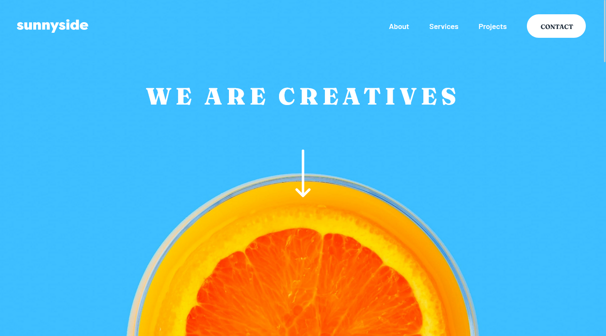

# Frontend Mentor - Sunnyside agency landing page solution

This is a solution to the [Sunnyside agency landing page challenge on Frontend Mentor](https://www.frontendmentor.io/challenges/sunnyside-agency-landing-page-7yVs3B6ef).

## Table of Contents

-   [Overview](#overview)
    -   [The challenge](#the-challenge)
    -   [Screenshot](#screenshot)
    -   [Links](#links)
-   [My process](#my-process)
    -   [Built with](#built-with)
    -   [What I learned](#what-i-learned)
-   [Setup](#setup)
-   [Author](#author)

## Overview

### The Challenge

Users should be able to:

-   View the optimal layout for the site depending on their device's screen size
-   See hover states for all interactive elements of the page

### Screenshot



### Links

-   Live Site URL: https://sunnyside-landing-page-five-hazel.vercel.app/

## My Process

### Built with

-   Semantic HTML5 markup
-   SCSS
-   Flexbox
-   Grid
-   Mobile-first workflow
-   Vanilla JS
-   Vite

### What I learned

I recently tried using `clamp` for creating responsive HTML instead of using media queries. At first, I found it overwhelming to understand how the formula for getting the preferred value for `clamp`. However, I found an online calculator that helped me speed up the process. I then decided to learn the basics of Vite, a build tool and used it for my project because it's faster and easier to learn compared to other build tools. I plan on learning Webpack in the future once I become more comfortable using build tools.

## Setup

To run this project, clone the repository and install it locally:

```bash
$ git clone https://github.com/oshudev/sunnyside-landing-page.git
$ cd sunnyside-landing-page
$ pnpm install
```

Start dev server and watch assets for changes:

```bash
$ pnpm run dev
```

_(optional)_ Start a local web server and locally preview the production build:

```bash
$ pnpm run build
$ pnpm run preview
```

## Author

-   Frontend Mentor - [@eurus1108](https://www.frontendmentor.io/profile/eurus1108)
